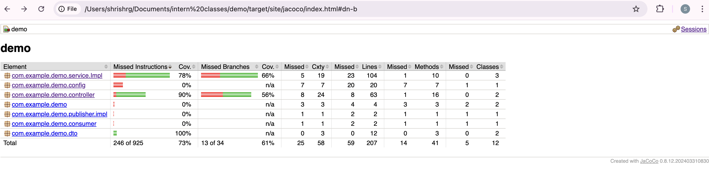
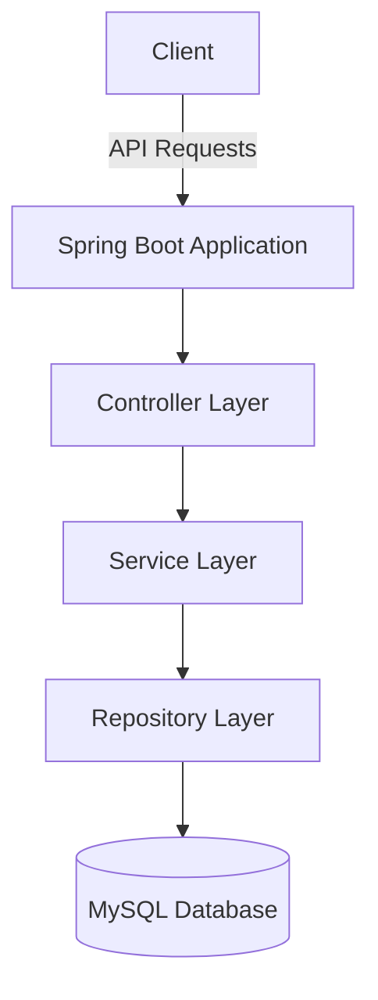
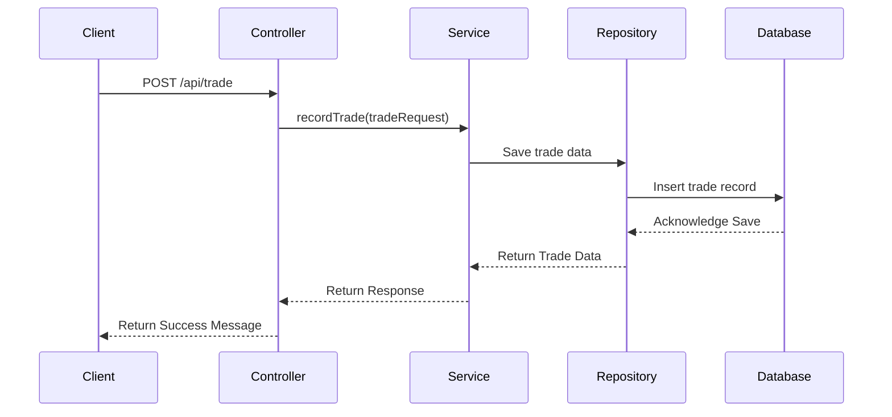

# Stocks Portfolio Application

This is a Spring Boot-based application designed to manage user stock portfolios. It provides RESTful APIs to manage users, stocks, and trades, including features like portfolio calculation and randomization of stock prices.

---

## Installation Steps

### Prerequisites
#### Installed
- Docker
- IDE (e.g., IntelliJ IDEA, Eclipse)
#### Optional
- Java 17 or later
- Maven 3.6+
- MySQL Server


### Steps
1. Clone the repository:
   ```bash
   git clone https://github.com/ShrishRajGupta/PortfolioGroww.git
   cd PortfolioGroww
   ```
2. Setup package
   ```bash
   mvn clean package
   ```
   
3. Build Docker image: 
   ```bash
   docker build -t demo-app .
   ```
   Maven build will be executes during creation of the docker image.

   >Note:if you run this command for first time it will take some time in order to download base image from [DockerHub](https://hub.docker.com/)

4. Run the application:
   ```bash
   docker run -d --name demo-app -p 8080:8080 demo-app
   ```

5. Access the APIs:
    - Base URL: `http://localhost:8080/api`

---
## Kubernetes Deployment

### Prerequisites
- Kubectl
- Docker
- Helm

### Steps
1. Create `secrets.yml` file with the following content:
   ```yaml
   apiVersion: v1
   kind: Secret
   metadata:
     name: mysql-secrets
   type: Opaque
   data:
     mysql-root-password: <base64-encoded-root-password>
     mysql-database: <base64-encoded-database-name>
     mysql-user: <base64-encoded-username>
     mysql-password: <base64-encoded-password>
   ```
   Replace `<base64-encoded-...>` with the base64-encoded values of your MySQL root password, database name, username, and password.
 
    >Note: You can use the following command to encode a string to base64:
    >```bash
    >echo -n "your-string" | base64'
    >```
   
2. Create a Kubernetes secret:
   ```bash
   kubectl apply -f secrets.yml
   ```
3. Create a Kubernetes deployment:
   ```bash
    kubectl apply -f k8s/deployment.yml
    ```
   
## Test Coverage




## API Endpoints


### 1. Record Trade
**Endpoint:** `POST /api/trade`

**Description:** Records a trade for a user and stock.

**Request Body:**
```json
{
  "userAccountId": 1,
  "stockId": 5,
  "tradeType": "BUY",
  "quantity": 10
}
```

**Response:**
```json
{
  "status": "SUCCESS",
  "message": "Trade recorded successfully."
}
```

---

### 2. Get Portfolio
**Endpoint:** `GET /api/portfolio/{userId}`

**Description:** Retrieves the portfolio details for a specific user.

**Response:**
```json
{
  "holdings": [
    {
      "stockName": "Stock1",
      "stockId": 1,
      "quantity": 10,
      "buyPrice": 100.0,
      "currentPrice": 105.0,
      "gainLoss": 50.0
    }
  ],
  "totalHoldingValue": 1050.0,
  "totalBuyPrice": 1000.0,
  "totalPL": 50.0,
  "totalPLPercentage": 5.0
}
```

---

### 3. Get Stock by ID
**Endpoint:** `GET /api/stocks/{stock_id}`

**Description:** Retrieves stock details for the specified stock ID.

**Response:**
```json
{
  "id": 5,
  "name": "Stock5",
  "openPrice": 105.0,
  "closePrice": 110.0,
  "highPrice": 115.0,
  "lowPrice": 100.0,
  "settlementPrice": 107.5
}
```

---

### 4. Update Stocks from CSV
**Endpoint:** `POST /api/stocks/update`

**Description:** Updates stock data by processing a CSV file.

**Request:**
- Form-Data with a file key containing the CSV file.

**Response:**
```json
"Stocks updated successfully."
```


### 5. Populate Users
**Endpoint:** `GET /api/populate/users`

**Description:** Adds 10 dummy user accounts to the database.

**Response:**
```json
"10 users added successfully."
```

---

### 6. Populate Stocks
**Endpoint:** `GET /api/populate/stocks`

**Description:** Adds 10 dummy stocks with predefined price ranges to the database.

**Response:**
```json
"10 stocks added successfully."
```

---

### 7. Populate Trades
**Endpoint:** `GET /api/populate/trades`

**Description:** Creates random trades for all users and stocks, with random trade types (`BUY` or `SELL`), quantities, and prices.

**Response:**
```json
"Trades with random data added for all users and stocks."
```

---

### 8. Randomize Stock Prices
**Endpoint:** `PUT /api/populate/stocks/update-prices`

**Description:** Updates stock prices (open, close, high, low, and settlement) to random values for all stocks in the database.

**Response:**
```json
"Stock prices randomized successfully."
```
---

## Repository Classes

### UserAccountRepository
**Description:** Handles CRUD operations for `UserAccount` entities.

**Methods:**
- `Optional<UserAccount> findByEmail(String email);`

---

### StockRepository
**Description:** Handles CRUD operations for `Stock` entities.

**Methods:**
- `Optional<Stock> findByName(String name);`

---

### TradeRepository
**Description:** Handles CRUD operations for `Trade` entities.

**Methods:**
- `List<Trade> findByUserAccountId(Long userAccountId);`
- `List<Trade> findByStockId(Long stockId);`

---

## Model Classes

### UserAccount
**Fields:**
- `Long id`
- `String name`
- `String email`
- `LocalDateTime createdAt`

---

### Stock
**Fields:**
- `Long id`
- `String name`
- `Double openPrice`
- `Double closePrice`
- `Double highPrice`
- `Double lowPrice`
- `Double settlementPrice`

---

### Trade
**Fields:**
- `Long id`
- `UserAccount userAccount`
- `Stock stock`
- `String tradeType`
- `Integer quantity`
- `Double price`
- `LocalDateTime createdAt`

---

## Diagrams

### System Architecture



### Data Flow for Trade API


---

## Licence 🍁
### [**MIT**](/LICENSE)  &copy; [Shrish Raj Gupta](https://github.com/ShrishRajGupta)

## Contributing 💙

PR's are welcome !Found a Bug ?

Create an [Issue](https://github.com/ShrishRajGupta/PortfolioGroww/issues).

## 💖 Like this project ?

Leave a ⭐ If you think this project is cool.
<p align="center"></p>
---

## Contact
For any issues, feel free to reach out via email at `shrishrg@gmail.com` or create an issue in the repository.


