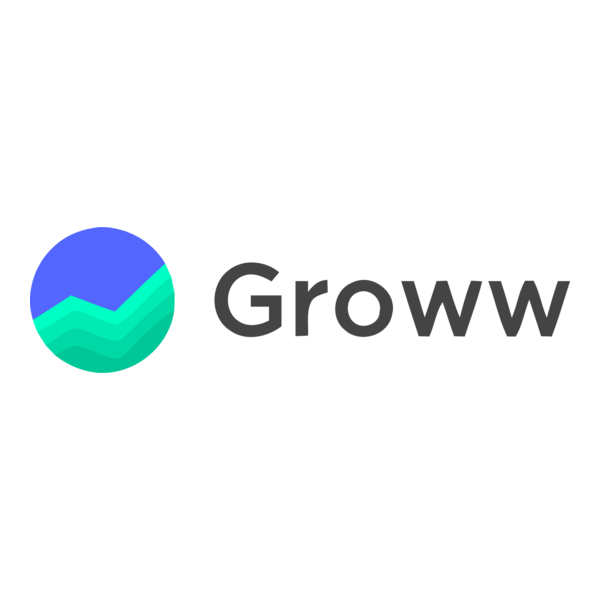
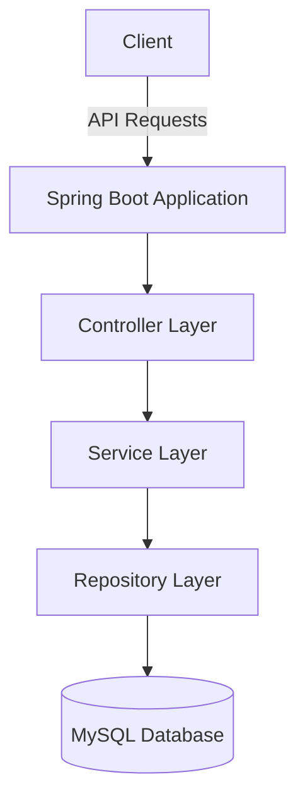
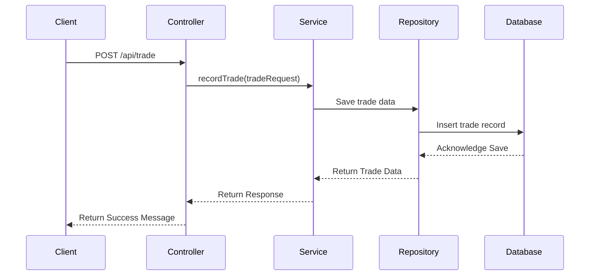
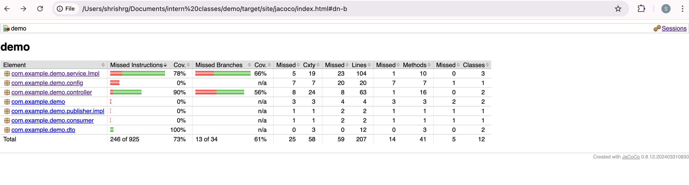

# Stocks Portfolio Application

<p style="text-align:center;"> 

</p>

This is a Spring Boot-based application designed to manage user stock portfolios. It provides RESTful APIs to manage users, stocks, and trades, including features like portfolio calculation and randomization of stock prices.

---

## Installation Steps

### Prerequisites
#### Installed
- Docker
- IDE (e.g., IntelliJ IDEA, Eclipse)
#### Optional
- Java 17 or later
- Maven 3.6+
- MySQL Server

## Diagrams

### System Architecture

```mermaid
flowchart TD
    A[Client] -->|API Requests| B[Spring Boot Application]
    B --> C[Controller Layer]
    C --> D[Service Layer]
    D --> E[Repository Layer]
    E --> F[(MySQL Database)]
```


### Data Flow for Trade API

```mermaid
sequenceDiagram;
    participant Client
    participant Controller
    participant Service
    participant Repository
    participant Database

    Client->>Controller: POST /api/trade
    Controller->>Service: recordTrade(tradeRequest)
    Service->>Repository: Save trade data
    Repository->>Database: Insert trade record
    Database-->>Repository: Acknowledge Save
    Repository-->>Service: Return Trade Data
    Service-->>Controller: Return Response
    Controller-->>Client: Return Success Message
```

---
  


### Steps
1. Clone the repository:
   ```bash
   git clone https://github.com/ShrishRajGupta/PortfolioGroww.git
   cd PortfolioGroww
   ```
2. Setup package
   ```bash
   mvn clean package
   ```
   
3. Build Docker image: 
   ```bash
   docker build -t demo-app .
   ```
   Maven build will be executes during creation of the docker image.

   >Note:if you run this command for first time it will take some time in order to download base image from [DockerHub](https://hub.docker.com/)

4. Run the application:
   ```bash
   docker run -d --name demo-app -p 8080:8080 demo-app
   ```

5. Access the APIs:
    - Base URL: `http://localhost:8080/api`

---
## Kubernetes Deployment

### Prerequisites
- Kubectl
- Docker
- Helm

### Steps
1. Create `secrets.yml` file with the following content:
   ```yaml
   apiVersion: v1
   kind: Secret
   metadata:
     name: mysql-secrets
   type: Opaque
   data:
     mysql-root-password: <base64-encoded-root-password>
     mysql-database: <base64-encoded-database-name>
     mysql-user: <base64-encoded-username>
     mysql-password: <base64-encoded-password>
   ```
   Replace `<base64-encoded-...>` with the base64-encoded values of your MySQL root password, database name, username, and password.
 
    >Note: You can use the following command to encode a string to base64:
    >```bash
    >echo -n "your-string" | base64'
    >```
   
2. Create a Kubernetes secret:
   ```bash
   kubectl apply -f secrets.yml
   ```
3. Create a Kubernetes deployment:
   ```bash
    kubectl apply -f k8s-deployment.yaml
    ```
   
## Test Coverage




## API Endpoints


### 1. Record Trade
**Endpoint:** `POST /api/trade`

Books a trade on the ledger. A `SELL` must not exceed the units currently held.

**Request Body:**
```json
{
  "clientTradeId": "3f9c2a1e-6d0b-4c9f-9e1a-2b7d8c4f5a10",
  "userAccountId": 1,
  "stockId": 2,
  "tradeType": "BUY",
  "quantity": 10,
  "executionPrice": 101.25
}
```

| Field | Notes |
|---|---|
| `clientTradeId` | optional idempotency key (≤ 36 chars). Replaying the same key returns the original trade instead of booking again |
| `tradeType` | `BUY` or `SELL` |
| `quantity` | integer > 0 |
| `executionPrice` | optional fill price per unit (≤ 4 decimals). Defaults to the stock's current close price |

**Response `200`:**
```json
{ "tradeId": 12, "status": "SUCCESS", "message": "Trade recorded successfully" }
```
A replay returns the same `tradeId` with `"message": "Trade already recorded"`.

**Errors** are RFC 7807 problem details (`application/problem+json`): `400` validation (per-field `errors` map) or malformed input, `404` unknown user or stock, `409` insufficient position (`SELL` beyond what is held) or duplicate key.

---

### 2. Get Portfolio
**Endpoint:** `GET /api/portfolio/{userId}`

Valued straight from the trade ledger in one query, using a weighted-average-cost book per stock: each `BUY` re-weights the average cost, each `SELL` realizes `(fill − avgCost) × quantity` and leaves the average cost of the remaining units unchanged. Open positions are listed; realized P&L of fully closed positions stays in the totals. Money has 4 decimals, percentages 2 — never `NaN`.

**Response:**
```json
{
  "holdings": [
    {
      "stockId": 1,
      "stockName": "ACME",
      "netQuantity": 6,
      "avgCost": 100.0000,
      "marketPrice": 120.0000,
      "costBasis": 600.0000,
      "marketValue": 720.0000,
      "unrealizedPnl": 120.0000,
      "realizedPnl": 120.0000
    }
  ],
  "totalMarketValue": 720.0000,
  "totalCostBasis": 600.0000,
  "totalUnrealizedPnl": 120.0000,
  "totalRealizedPnl": 120.0000,
  "totalPnl": 240.0000,
  "unrealizedReturnPercentage": 20.00
}
```

| Field | Meaning |
|---|---|
| `netQuantity` | units held = BUY − SELL quantity |
| `avgCost` | weighted-average cost per unit of the units still held |
| `costBasis` / `marketValue` | `avgCost × netQuantity` / `marketPrice × netQuantity` |
| `unrealizedPnl` | `marketValue − costBasis` |
| `realizedPnl` | locked in by SELLs so far |
| `totalPnl` | `totalUnrealizedPnl + totalRealizedPnl` |
| `unrealizedReturnPercentage` | `totalUnrealizedPnl / totalCostBasis × 100`; `0.00` when nothing is held |

---

### 3. Get Stock by ID
**Endpoint:** `GET /api/stocks/{stock_id}`

**Description:** Retrieves stock details for the specified stock ID.

**Response:**
```json
{
  "id": 5,
  "name": "Stock5",
  "openPrice": 105.0,
  "closePrice": 110.0,
  "highPrice": 115.0,
  "lowPrice": 100.0,
  "settlementPrice": 107.5
}
```

---

### 4. Update Stocks from CSV
**Endpoint:** `POST /api/stocks/update`

**Description:** Updates stock data by processing a CSV file.

**Request:**
- Form-Data with a file key containing the CSV file.

**Response:**
```json
"Stocks updated successfully."
```


### 5. Populate Users
**Endpoint:** `POST /api/populate/users` _(dev profile only)_

**Description:** Adds 10 dummy user accounts to the database.

**Response:**
```json
"10 users added successfully."
```

---

### 6. Populate Stocks
**Endpoint:** `POST /api/populate/stocks` _(dev profile only)_

**Description:** Adds 10 dummy stocks with predefined price ranges to the database.

**Response:**
```json
"10 stocks added successfully."
```

---

### 7. Populate Trades
**Endpoint:** `POST /api/populate/trades` _(dev profile only)_

**Description:** Creates random trades for all users and stocks, with random trade types (`BUY` or `SELL`), quantities, and prices.

**Response:**
```json
"Trades with random data added for all users and stocks."
```

---

### 8. Randomize Stock Prices
**Endpoint:** `PUT /api/populate/stocks/update-prices`

**Description:** Updates stock prices (open, close, high, low, and settlement) to random values for all stocks in the database.

**Response:**
```json
"Stock prices randomized successfully."
```
---

## Repository Classes

### UserAccountRepository
**Description:** Handles CRUD operations for `UserAccount` entities.

**Methods:**
- `Optional<UserAccount> findByEmail(String email);`

---

### StockRepository
**Description:** Handles CRUD operations for `Stock` entities.

**Methods:**
- `Optional<Stock> findByName(String name);`

---

### TradeRepository
**Description:** Handles CRUD operations for `Trade` entities.

**Methods:**
- `List<Trade> findByUserAccountId(Long userAccountId);`
- `List<Trade> findByStockId(Long stockId);`

---

## Model Classes

### UserAccount
**Fields:**
- `Long id`
- `String name`
- `String email`
- `LocalDateTime createdAt`

---

### Stock
**Fields:**
- `Long id`
- `String name`
- `Double openPrice`
- `Double closePrice`
- `Double highPrice`
- `Double lowPrice`
- `Double settlementPrice`

---

### Trade
**Fields:**
- `Long id`
- `UserAccount userAccount`
- `Stock stock`
- `String tradeType`
- `Integer quantity`
- `Double price`
- `LocalDateTime createdAt`


## Licence 🍁
### [**MIT**](/LICENSE)  &copy; [Shrish Raj Gupta](https://github.com/ShrishRajGupta)

## Contributing 💙

PR's are welcome !Found a Bug ?

Create an [Issue](https://github.com/ShrishRajGupta/PortfolioGroww/issues).

## 💖 Like this project ?

Leave a ⭐ If you think this project is cool.
<p align="center"></p>
---

## Configuration & Schema

- **Profiles:** `dev` is the default for local runs (SQL logging on, `/api/populate/*` seed endpoints enabled). Deployments set `SPRING_PROFILES_ACTIVE=prod`.
- **Environment:** `MYSQL_HOST`, `MYSQL_PORT`, `MYSQL_DATABASE` (or `MYSQL_DB`), `MYSQL_USER`, `MYSQL_PASSWORD`, `KAFKA_BOOTSTRAP_SERVERS` (defaults `localhost:9092`), `STOCK_SHEET_URL`, `STOCK_PRICE_CRON`. No host addresses are hardcoded in the app.
- **Schema migrations:** the database schema is owned by [Flyway](https://flywaydb.org) — versioned SQL lives in `src/main/resources/db/migration` (`V1__baseline.sql` onward) and Hibernate runs in `validate` mode. Databases created earlier by `ddl-auto=update` are adopted automatically (`baseline-on-migrate`).
- **Stock prices:** refreshed daily (`STOCK_PRICE_CRON`) from the published sheet, or on demand via `POST /api/stocks/update` (CSV upload). Rows are upserted by stock name.

## Contact
For any issues, feel free to reach out via email at `shrishrg@gmail.com` or create an issue in the repository.
